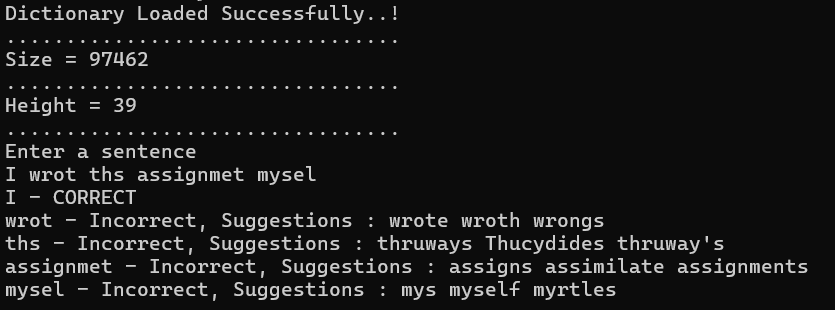

# BST-Dictionary
spell-checking system using a Binary Search Tree to verify word accuracy in a sentence and provide suggestions for incorrect words. Implemented efficient word lookup, including inorder predecessor and successor suggestions

